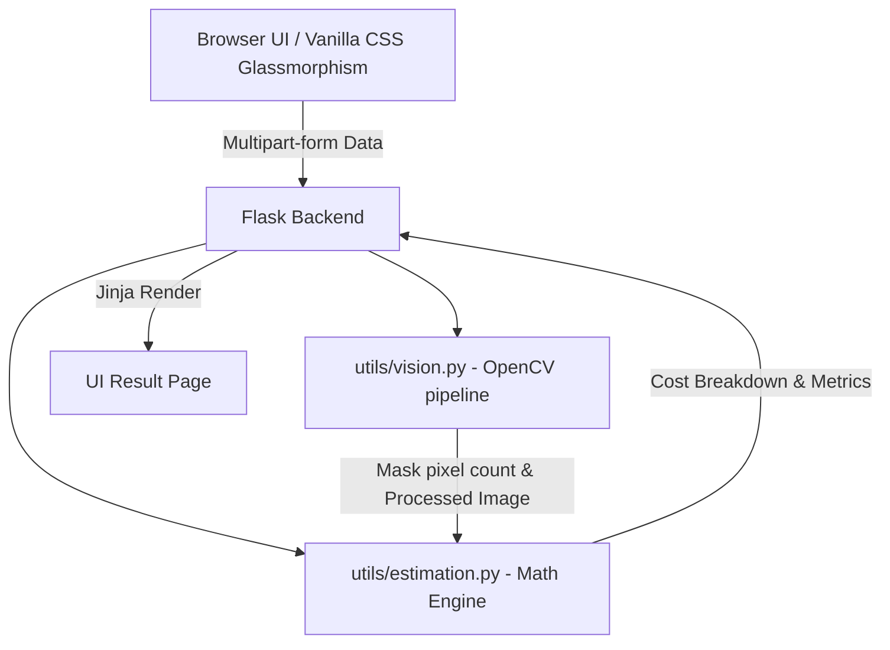
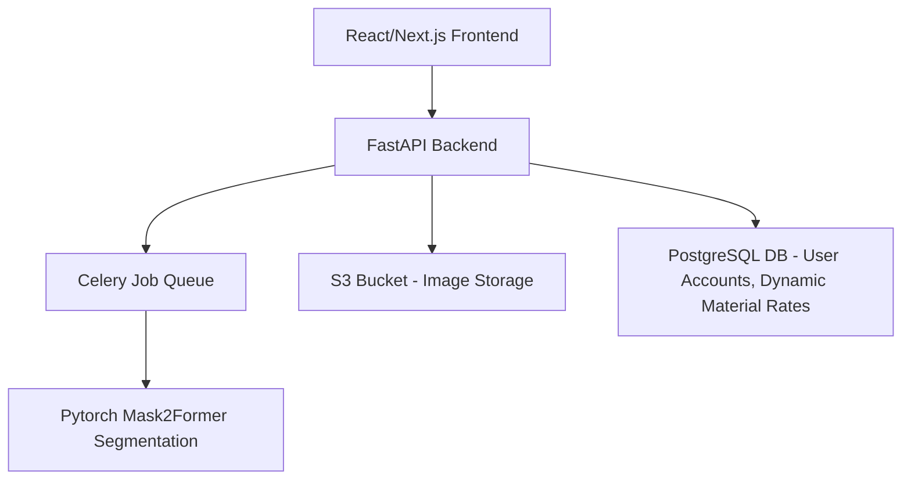

# System Architecture

## Current Prototype Architecture
Because this is a 24-hour assignment prototype, we prioritize functionality, visual excellence, and rapid workflow using a localized architecture.

### Components
1. **Frontend**: A highly responsive, modern "Glassmorphism" UI built with Vanilla CSS (`index.css`) and HTML. Prints directly as a report.
2. **Backend**: Python/Flask acting as an API gateway and orchestrator.
3. **Computer Vision Layer**: 
    - **cv2.GrabCut**: Isolates the foreground object (the house) from the background (sky, objects).
    - **Luminance Thresholding**: Prevents painting over windows and deep shadows.
    - **Multiply/Overlay Blending**: Retains original object geometry (bricks, shadows) to make the added Paint or Texture highly realistic.
4. **Estimation & Costing Engine**: Scales pixel count to square footage using reference metrics, automatically appending 10% wastage and multiplying against a predefined local flat-rate material/labor database.

## Ideal Scaled Architecture (Production)
For a future scaling of this project beyond the prototype, the architecture would shift to a microservice-based model leveraging Deep Learning:

- **Segmentation**: Upgrading from OpenCV's GrabCut to an ML model like `Mask2Former` or `DeepLabV3` trained on housing exteriors for precise window/door/wall semantic segmentation.
- **Frontend**: A Next.js PWA providing interactive canvas elements so users can individually paint different walls with different materials dynamically.
- **Database**: A PostgreSQL database where contractors can upload live material rates.
